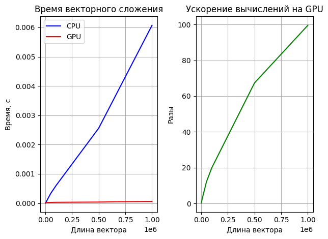

# Vector Sum

Потыкаться в программе можно **[тут](https://colab.research.google.com/drive/1-DHL2RflJo4afixpCBz-03iAgoHMoLSb?usp=sharing)**

Для сложения двух векторов типа **float** была написана функция ядра  **_void vecSumKernel_**.

#### Принцип распараллеливания вычислений заключается в том, что каждое **cuda ядро** вычисляет сумму для нескольких элементов векторов a и b, записывая результат в вектор **c**. То что одно ядро вычисляет сумму для нескольких ячеек вектора c обусловлено ограниченностью block_size в cuda (максимальный размер 1024).

Последовательность работы программы:
1. Векторы а и b заполняются значениями от 1 до n.
2. Вызывается функия сложения векторов на CPU.
3. Затем вектора a и b копируются из памяти хоста в память девайса.
4. Запускается ядро куды.
5. Фиксируется время выполнения функции ядра.
6. Вывод результатов.

### Графики времени выполнения и ускорения:

